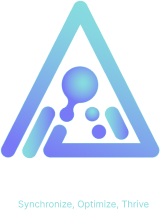
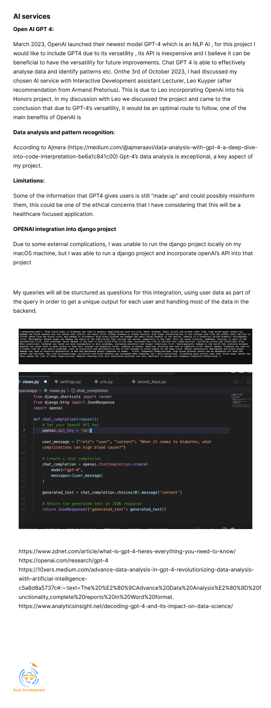

# UniVerse

<!-- Repository Information & Links-->
<br />


<!-- HEADER SECTION -->
<h5 align="center" style="padding:0;margin:0;">Leander van Aarde - 200211</h5>
<h6 align="center">DV300 - Term 4 | 2023</h6>
</br>
<p align="center">

  <a href="https://github.com/">
    
  </a>

  <p align="center">
   Diasync is an AI-driven self management application for Diabetics. <br>

   <br />
   <br />
    <a href="https://github.com/https://github.com/LeandervanAarde/diasync">Report Bug</a>
    ·
    <a href="https://github.com/https://github.com/LeandervanAarde/diasync">Request Feature</a>
</p>
<!-- TABLE OF CONTENTS -->

## Table of Contents

- :hospital: [About the Project](#about-the-project)
  - :syringe: [Project Description](#project-description)
  - :syringe:[Built With](#built-with)
- :hospital: [Getting Started](#getting-started)
  - :syringe: [Prerequisites](#prerequisites)
  - :syringe: [How to install](#how-to-install)
- :hospital: [Features and Functionality](#features-and-functionality)
- :hospital: [Concept Process](#concept-process)
  - :syringe: [Ideation](#ideation)
  - :syringe: [Wireframes](#wireframes)
- :hospital: [Development Process](#development-process)
  - :syringe: [Implementation Process](#implementation-process)
    - :syringe: [Highlights](#highlights)
    - :syringe: [Challenges](#challenges)
  - :syringe: [Future Implementation](#peer-reviews)
- :hospital: [Final Outcome](#final-outcome)
  - :syringe: [Mockups](#mockups)
- :hospital: [Conclusion](#conclusion)
- :hospital: [License](#license)
- :hospital: [Contact](#contact)
- :hospital: [Acknowledgements](#acknowledgements)

<!--PROJECT DESCRIPTION-->

## About the Project

<!-- header image of project -->


### Project Description

Diasync is a new and AI-driven self-management web application created with NEXT.JS and Django frameworks to create an exciting and cutting-edge application. This aims at educating and catering a diverse group of Diabetics in order to simplify and ease their management in order to live a long and healthy life

[](https://git.io/typing-svg)

### Built With

- [NEXT](https://nextjs.org/)
- [Django](https://www.djangoproject.com/)
- [DjangoRestFramework](https://www.django-rest-framework.org/)
- [Pandas](https://pandas.pydata.org/)
- [OpenAiApi](https://openai.com/)
- [TypeScript]()
- [PostgreSQL](https://www.postgresql.org/)
- [pgAdmin](https://www.pgadmin.org/)
- [Aiven](https://aiven.io/)

<!-- GETTING STARTED -->
<!-- Make sure to add appropriate information about what prerequesite technologies the user would need and also the steps to install your project on their own mashines -->

## Getting Started

To get a copied file of this repository, follow the steps below to get it installed on your local machine.

### Prerequisites

Ensure that you have the latest version of [NPM](https://www.npmjs.com/) installed on your machine. The [GitHub Desktop](https://desktop.github.com/) program will also be required.

### How to install

### Installation

Here are a couple of ways to clone this repo:

1.  GitHub Desktop </br>
    Enter `https://github.com/LeandervanAarde/diasync.git` into the URL field and press the `Clone` button.

2.  Clone Repository </br>
    Run the following in the command-line to clone the project:

    ```sh
    git clone https://github.com/LeandervanAarde/diasync.git
    ```

        Open `Software` and select `File | Open...` from the menu. Select cloned directory and press `Open` button

3.  Install Dependencies </br>
    Run the following in the command-line to install all the required dependencies:

    ```sh
    npm install / npm i
    ```

4.  Contact the [Developer](mailto:200211@virtualwindow.co.za) for API keys that are required or create an OPENAI account for API access.
5.  Follow the instructions on [Server](https://github.com/LeandervanAarde/diasyncserver) to clone the server, contact the [Developer](mailto:200211@virtualwindow.co.za) for access to the Database or create a Database and .env.local file.

6.  Ensure that you have Postgres and PgAdmin installed on your machine.

7.  Ensure that pip3 and python3 are installed on your local machine.
8.  </br>

9.  You can now run the front end using the:
    ```sh
    npm run dev
    ```
    command.
    <!-- FEATURES AND FUNCTIONALITY-->
    <!-- You can add the links to all of your imagery at the bottom of the file as references -->

## Features and Functionality

<!-- note how you can use your gitHub link. Just make a path to your assets folder -->


### Register new accounts

Create a new account on Diasync by sharing essential personal details and uploading your blood sugar readings from your Contour glucose monitor. This enables our AI to perform a thorough analysis of your data.

### Login validation and authentication

Access your account securely by logging in with your email and password. Rest assured, all passwords are encrypted to safeguard your privacy. Your login not only provides you with exclusive access to your blood glucose readings but also ensures that your data remains confidential and secure


### Dashboard View

Diasync's Dashboard offers users a comprehensive overview of their blood sugar data. It includes intuitive data visualization tools and predictive insights into potential future complications, all powered by the OpenAI API. Stay informed and take control of your health with our user-friendly dashboard.

#### Right Bar with your information

Get a basic overview of how many tests you have on the platform and information such as an estimated HBA1C.


### Readings View

Explore a detailed breakdown of your blood glucose levels on the Readings page, also known as the Diary view. Easily identify the frequency of high, low, and stable blood sugar readings for a more comprehensive understanding of your health. You can also conveniently filter data for the current month, providing you with up-to-date insights into your blood sugar management."

### Upload new Data

After registering, feel free to upload additional data at your convenience whenever you have new readings that need evaluation. You can trust that our system automatically manages your data, removing older values with the assistance of advanced tools like Pandas and Django. This ensures that your information remains up-to-date and relevant for analysis.


### Analayse View

Utilising your data, OpenAI conducts a comprehensive analysis of your blood sugar, offering insights into your control and stability compared to the previous month, all catered to you. Additionally, OpenAI provides dietary recommendations and suggests informative articles to empower you in better blood sugar management.

#### Not enough?

Once your data has been thoroughly analyzed and you seek further information, feel free to ask OpenAI any questions you have in mind. OpenAI is well-versed in your blood sugar patterns and will provide personalized responses to address your specific needs.

<!-- CONCEPT PROCESS -->
<!-- Briefly explain your concept ideation process -->
<!-- here you will add things like wireframing, data structure planning, anything that shows your process. You need to include images-->

## Concept Process

The `Conceptual Process` is the set of actions, activities and research that was done when starting this project.

### Research

In the process of problem identification, I initially conducted research to pinpoint a specific issue within my chosen field. Once I identified the problem, I proceeded to conduct additional research to ensure that I had accurately selected the primary problem and not merely an aspect of it. Lastly, researching an AI that would be suitable for multiple use cases such as data analysation and NLP capabilities.

-2.png>)
.png>)
-1.png>)
-2.png>)



<br />
<br />

### Ideation


<br />
<br />


<br />
<br />


### Wireframes


<!-- DEVELOPMENT PROCESS -->

## Development Process

The `Development Process` is the technical implementations and functionality done in the frontend and backend of the application.
If you would like information about the backend implementation, you can go view the [Server Repo](https://github.com/LeandervanAarde/diasyncserver)

### Implementation Process

<!-- stipulate all of the functionality you included in the project -->
<!-- This is your time to shine, explain the technical nuances of your project, how did you achieve the final outcome!-->

#### Starting with the Front End

In the front-end development process:

1. **Component Breakdown:** Each page underwent a meticulous examination to identify elements that could be divided into reusable components for present and future implementation.

2. **Logic and Reusability:** After identifying components, their logic was implemented and further segmented into reusable functions. Specific variables were stored to enable global accessibility, eliminating the need for redundant code.

3. **File Uploads:** A crucial aspect of the front end was enabling data transfer to the backend, especially for file uploads. This challenge was conquered using the React-Dropzone Dependency. The file content was read and converted into a URL, stored in a state, and then sent to the backend after encryption as base64 data, with provisions for decryption on the backend.

4. **API Calls:** All API calls were organized as functions within a single file. This approach streamlined the process of locating data-related functions and ensured flexibility for future code modifications.

5. **Type Consistency:** TypeScript was implemented in the project to maintain uniform variable types, declared at the outset of each variable for consistency and reliability.

6. **Data Organization:** Data was logically grouped by day, although it's now handled on the front end. Future implementation plans aim to incorporate data manipulation on the backend, enhancing efficiency and data management.

#### Following Basic Front-End Implementation, Integration Was the Next Step

1. **API Calls:** All API calls, as previously mentioned, are centralized in a dedicated file and can be invoked from anywhere in the project. This organization is facilitated by Axios, which minimizes the need for widespread Axios imports, making future dependency changes and maintenance more straightforward.

2. **Validation:** The login and register components incorporate input validation to ensure that data is correctly parsed and meets specific requirements. For instance, there is a regex pattern for email validation, guaranteeing that email inputs are valid. Additionally, registration values must adhere to predefined structures for the process to be completed.

3. **Loaders:** Due to performance limitations with Aiven's free-tier database in conjunction with Django, data retrieval times can be notably slow. To address this concern, a loader has been implemented to provide users with reassurance that data is being fetched and loaded, alleviating potential frustration. Future iterations will aim to optimize this issue.

4. **Context:** To streamline code and minimize the need for frequent token calls and session storage of sensitive data, context management has been established. Upon login, these contexts are configured, granting access to global variables. This approach not only simplifies data handling but also reduces the number of calls, conserves tokens used with the OpenAI API, and enhances data transfer throughout the project as needed.

#### Highlights

<!-- stipulated the highlight you experienced with the project -->

- This is a project that I've been wanting to do for a while, something that I felt has the ability to make a real impact.
- The project is something that I can use on a daily basis, as a type 1 Diabetic, I have gotten a lot of insights on my own data throughout the entire development process.
- Learning more about Django, while I do enjoy Django, it's not something I see myself using for large-scale projects in the future. It is a backend that I would use for quick implementation due to the simplicity of its nature.
- Using typescript was great, coming from C# and MAUI, it felt a lot more structured than Javascript and I felt I had more confidence throughout the project.
- Learning how to upload data was really cool.

#### Challenges

<!-- stipulated the challenges you faced with the project and why you think you faced it or how you think you'll solve it (if not solved) -->

- Data upload was probably my biggest challenge, with some inconsistencies still bein there.
- AI integration was a challenge due to its incosistent responses, OpenAI is not considered an AI for this kind of application, however, it did give me the versatility that I needed. Adapting to that was a challenge. However, it still gives extremely valuable insight.
- Syntax adjustment between Python and TypeScript.
- Next and Django are both new technologies that I have not used in the past, so learning these as I went along was a challenge.

### Future Implementation

<!-- stipulate functionality and improvements that can be implemented in the future. -->

- Refinement of the application's UI
- Data upload refinement
- Performance updates for loading time decreases.
- Building an AI specifically for this would be really cool.

<!-- MOCKUPS -->

## Final Outcome

### Mockups


<br>


<br>


<br>


<br>

<br>
See the [open issues](https://github.com/LeandervanAarde/diasync/issues) for a list of proposed features (and known issues).

<!-- AUTHORS -->

## Authors

- **Leander van Aarde** - [LeanderVanAarde](https://github.com/LeandervanAarde)

<!-- LICENSE -->

## License

Distributed under the MIT License. See `LICENSE` for more information.\

<!-- LICENSE -->

## Contact

- **Leander van Aarde** - [200211@virtualwindow.co.za](mailto:200211@virtualwindow.co.za)

- **Project Link** - https://github.com/LeandervanAarde/diasync
- **Project Link** - https://github.com/LeandervanAarde/diasyncserver

<!-- ACKNOWLEDGEMENTS -->

## Acknowledgements

<!-- all resources that you used and Acknowledgements here -->

- [illustrations](https://www.freepik.com/)
- [Next Documentation](https://nextjs.org/docs)
- [ReactDropZone](https://react-dropzone.js.org/)
- [LoaderAnimation](https://tailwindflex.com/freja-jensen/square-loding-spinner)
- [ContextApiWithNext](https://dev.to/shareef/context-api-with-typescript-and-next-js-2m25)
- [Tailwind](https://tailwindcss.com/)
- [Charts](https://quickchart.io/documentation/chart-js/custom-pie-doughnut-chart-labels/)
